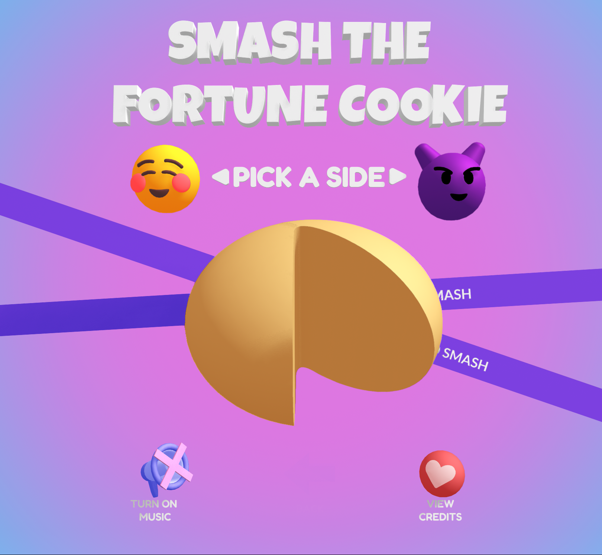
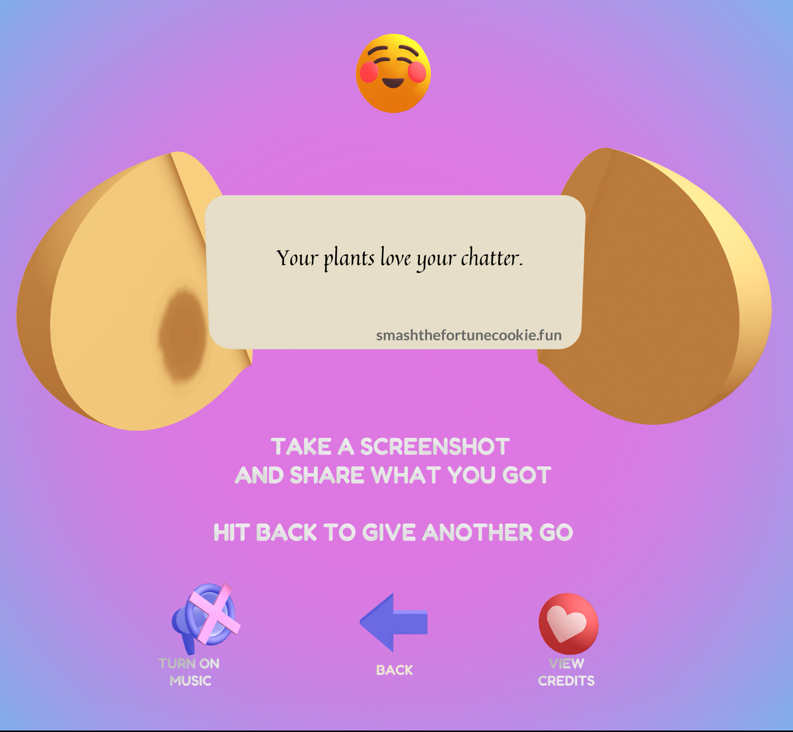
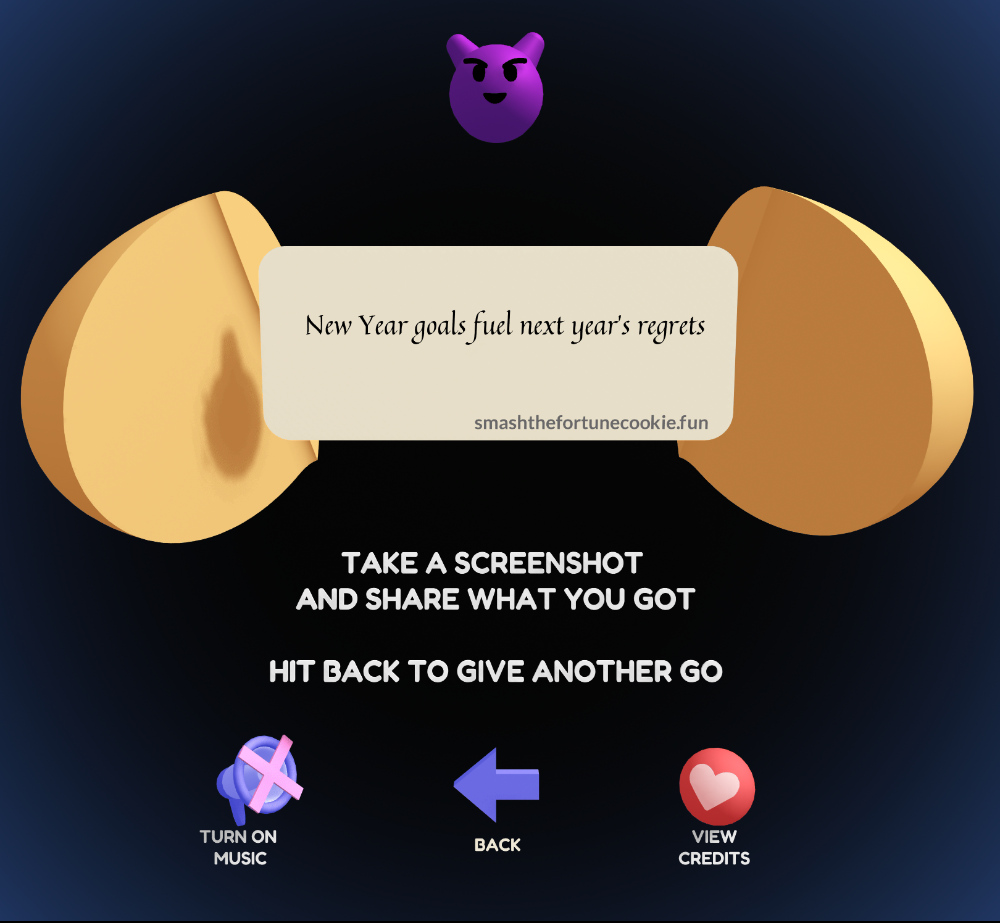

# Smash The Fortune Cookie

This repository is the backend for a game I made https://smashthefortunecookie.fun. It is responsible for generating the wholesome or dark fortune cookie messages.

Feel free to use this to make your own project or to learn how my game was built.

## Game Screenshots

### Homepage



### Nice Fortune Cookie



### Naughty Fortune Cookie



## Where is the Front End?

The frontend is built using https://spline.design so there isn't a frontend repository. But, I have made a [modified version](https://app.spline.design/community/file/d6076bba-ed75-41cf-92b4-054de32204a5) of the file accessible in the Spline community and you can remix this to make your own game.

The modified version does not contain 2 things:

1. The [soundtrack](https://www.chosic.com/download-audio/59068/) has been removed to avoid any music distribution violation
2. The API integration with my hosted backend has been removed to avoid rate limit issues or abuse.

## How to deploy this backend?

1. Clone the repository:
   ```bash
   git clone https://github.com/tavishcode/fortune-cookie
   ```
2. Navigate to the project directory:
   ```bash
   cd fotunecookie
   ```
3. Install dependencies:
   ```bash
   npm install
   ```

## Usage

Start the development server:

```bash
npm start
```

Open your browser and go to `http://localhost:3000` to use the app.

## Credits

Full credits for the whole game available on https://smashthefortunecookie.fun

The backend itself was mainly written using large language models (AI) and uses several open source libs

If there are resources you noticed that I missed, please let me know.

## Feedback

If you have any positive/negative comments about this project please reach out to me on email at tavish [dot] gobindram [at] gmail [dot] com, [twitter](https://x.com/tavishtweets), [linkedin](https://www.linkedin.com/in/tgobindram) or [instagram](https://instagram.com/instavish25)

If you loved the project, then please give it a star. And if you want to check out some of my other projects visit https://tavish.mmm.page
